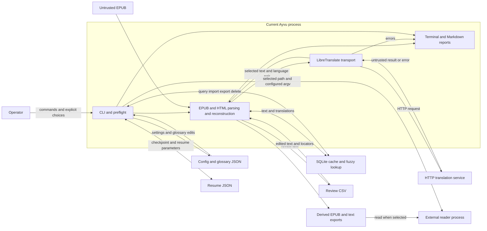

# Product security, privacy, and data flows

Status: `Proposed`

Date: 2026-09-29

Related issue: [#129 — DESKTOP-008](https://github.com/MichaelAlexandreDev/ayvu/issues/129)

Evidence baseline: `main` at `1a28b84` (PR #186). This is a source-based threat
assessment, not a penetration test, security certification, or acceptance of
residual risk. Controls described as proposed are not implemented by this
document. Closing the documentation issue does not accept this model or any
other proposed architecture decision.

## Scope and decision boundary

The delivered product is the local Python CLI described in the
[product scope](../product-scope.md). It reads EPUBs, translates through an HTTP
service, maintains SQLite cache and JSON settings/checkpoints, exports Markdown
and CSV, applies reviewed text, and can launch an external reader. The
[accepted module boundaries](modular-monolith-boundaries.md) supply ownership;
the [shared use-case matrix](shared-use-case-matrix.md) describes future seams.

Desktop, local API, inbound/outbound MCP, plugins, AI assistance, managed models,
durable projects/jobs, approved translation memory, and contributed training
corpus are proposed boundaries. A configurable HTTP URL already permits remote
translation today; destination classification and purpose-specific authorization
are future controls. The current CLI has no account or multi-tenant boundary.

The original must remain immutable, derived outputs must preserve the supported
EPUB structure, and only selected reader-visible text should reach translation.
The [characterization baseline](../translation-workflow-migration-baseline.md)
tests normal workflows, not every hostile file or output alias. In particular,
the source/destination alias gap in T01 remains an implementation risk even
though immutability is a product invariant.

No book, private glossary, credential, cache, or user checkpoint was used as
evidence. Paths below describe documented defaults or repository sources, never
an inspected user's data. There is no permission here to remove DRM, acquire
books, distribute protected content, upload data, or implement the mitigations.

## Assets, actors, and assumptions

| Class | Assets and sensitivity | Required treatment |
| --- | --- | --- |
| C1: content | Original and translated text, EPUB assets, review rows, glossary terms, missing-text exports, future context | Confidential by default; preserve source; minimize recipients and copies |
| C2: identifying metadata | Titles, authors, filenames, absolute paths, endpoints, language pairs, timestamps and stable hashes | Potentially identifying; neither metadata nor hashes imply public/anonymous data |
| C3: credentials and authority | Credentials embedded in a URL/environment, future secret references, approvals and capabilities | Values stay out of persisted contracts/diagnostics; references still require authorization |
| C4: state and provenance | Config, cache identity, checkpoints, future manifests, revisions, lineage, rights and revocation records | Validate as input; reject stale/ambiguous state; separate history from mutation authority |
| C5: execution assets | CPU, RAM, disk, process handles, dependency packages, model/plugin artifacts | Bound resource use and authority; verify origin and integrity |

Actors are the operator, another local account/process, an untrusted book or
review author, a malicious or compromised provider/reader, package maintainers,
and future API/MCP clients, tool/model suppliers and corpus recipients. An
operator can make an unsafe choice without intending an attack. A same-user
process can edit settings/checkpoints or replace files between checks and use.

Ayvu currently runs with the operator's OS privileges. The OS, Python runtime
and installed dependencies are part of the trusted computing base, not a
sandbox proven by Ayvu. OS compromise and malicious dependency execution can
defeat in-process checks. An independently running translator or reader has its
own filesystem/network authority, logging and retention. Loopback location does
not establish trust in that process or its downstream recipients.

## Current data flows and trust boundaries

Solid arrows below describe existing flows. Every node outside the Ayvu process
crosses an OS file, network, process, or human boundary; local storage is not
automatically trusted input.

| ID / owner | Entry and flow, grounded in current code | Existing check and remaining boundary |
| --- | --- | --- |
| B01 / Interfaces + Policies | CLI arguments/prompts and [config.py](../../src/ayvu/config.py) select paths, folders, profiles and reader command | Typer/path checks, folder-name validation and overwrite prompts exist; they are not a reusable scoped authorization decision |
| B02 / Formats + Content | [epub_io.py](../../src/ayvu/epub_io.py): `inspect_epub`, `translate_epub`, `extract_markdown`, ZIP/container/OPF/spine lookup; [html_translate.py](../../src/ayvu/html_translate.py): `translate_html` | ZIP members are read and repackaged, not extracted wholesale to host paths; no intake budget or complete canonical-name/duplicate policy precedes parser reads |
| B03 / Translation + Providers + Policies | [preflight.py](../../src/ayvu/preflight.py) resolves routes; [translator.py](../../src/ayvu/translator.py) performs GET languages and POST text/languages; routed translation may make two hops | Timeout, retry/backoff, rate limiting and response-shape checks exist; destination/proxy/redirect authorization and response-size budgets do not |
| B04 / Knowledge | [cache.py](../../src/ayvu/cache.py) stores and imports/exports text; [translation_memory.py](../../src/ayvu/translation_memory.py) retrieves fuzzy candidates; [glossary.py](../../src/ayvu/glossary.py) loads/edits terms | SQL values are parameterized and import hashes validated; JSON import materializes the full payload without size or entry limits; hashes do not authenticate translations; cache has no provider identity or approved-TM lifecycle |
| B05 / Review + Formats | [review_export.py](../../src/ayvu/review_export.py): `write_review_csv`; [review_import.py](../../src/ayvu/review_import.py): `read_review_csv`; `apply_reviewed_epub` reconstructs a derived EPUB | Required columns, duplicate IDs and source-text consistency have checks; row materialization is not bounded by an Ayvu budget; CSV spreadsheet formulas and full source-bound identity are not controlled |
| B06 / Jobs + Infrastructure | [resume.py](../../src/ayvu/resume.py): `ResumeStateStore.save/load`; [cli.py](../../src/ayvu/cli.py): `_resume_translation` restores paths, URL and execution parameters | Version/field validation exists; write is direct and resume uses `overwrite=True`; no durable job identity, lease or source fingerprint authenticates that state |
| B07 / Formats + Infrastructure + Policies | `epub_io._copy_epub_with_replacements`, Markdown extraction and CLI review/report/missing-text writers publish files | Normal output conflicts are checked; ZIP output opens in `w` mode; canonical aliases, race-safe handles and validate-before-publication staging are not enforced |
| B08 / Library + Infrastructure | [library.py](../../src/ayvu/library.py): `scan_library`, `open_library_epub`, `_reader_command` | Selected path must be a file; launch uses argument vector, not a shell string; configured executable, inherited environment and reader behavior remain outside containment |
| B09 / Interfaces + Policies | CLI terminal/progress/errors and `_render_markdown_report` consume names, warnings and provider/parser error text | Common mode hides some expected-error detail; there is no universal sanitization envelope; provider error bodies can reach reports |
| B10 / Maintainer + Infrastructure | [pyproject.toml](../../pyproject.toml), [uv.lock](../../uv.lock) and [CI](../../.github/workflows/tests.yml) install/build dependencies | Lock checks, pinned Actions and package smoke are delivered; these do not certify package safety or implement a model/plugin/update installer |

HTML skips scripts/styles/code and other excluded nodes for translation; this
is not active-content removal. Existing book markup/assets are preserved and a
reader can interpret them. `html_translate` escapes translated/reviewed text
before fragment reconstruction, but robust placeholder topology validation is
future work. Treat malicious returned text as an integrity input, not as proof
of code execution in Ayvu.

## Storage, recipients, retention, and deletion

The following inventory describes current copies and egress. Current file
permissions follow ordinary OS/default creation behavior; there is no general
Ayvu encryption-at-rest or restricted-permission guarantee. No automatic corpus
upload, telemetry collector or model updater exists in the delivered code.

| Store / copy | Classes and location policy | Recipient, retention and deletion today |
| --- | --- | --- |
| Original and derived EPUBs | C1/C2; user-selected input/output, or configured book folders | Local operator and selected reader; outputs kept until removed; no automatic original deletion |
| Exact cache / fuzzy candidates | C1/C2/C4; `--cache`, default `.cache/traducoes.sqlite` relative to working directory | Original and translated strings stored in cleartext with pair/hash/time; no automatic TTL; cache-clean deletes selected rows, not all exported copies or forensic remnants |
| Cache interchange JSON | C1/C2/C4; explicit import/export paths | Export copies selected text pairs, potentially all rows; remains independently after cache deletion; imported data is untrusted |
| Glossary JSON | C1/C2; selected glossary/profile path or guided glossary directory | Terms/replacements retained until edited/removed; no corpus consent follows from glossary use |
| Config JSON | C2/C4; `ConfigStore` chooses XDG config or home fallback | Folders, reader command and named profiles persist until changed/removed; contains paths, not implemented secret-store references |
| Resume JSON | C2/C4 and possibly C3 in URL; configured processing folder | Absolute source/output/cache/glossary paths, endpoint and counters persist, including completed state; no lifecycle purge or cryptographic authority binding |
| Review CSV | C1/C2; explicit review output | Original/translated text, file/document names and paths can be read by spreadsheet software or shared by operator; no automatic deletion or recipient revocation |
| Markdown, missing-text file, terminal | C1/C2, potentially reflected C3; configured/selected output and terminal | Reports include paths/errors; missing exports include untranslated content; scrollback, shell redirection, backups and copied files have independent retention |
| HTTP service and intermediaries | C1 for submitted chunks, C2 for language/endpoint/request metadata, possible ambient C3 | Provider receives text on cache misses/probes; proxies/redirects may add recipients; server logging, training, backup and deletion are not controlled or attested by Ayvu |
| Process memory / external reader | C1–C5; Python heap, worker threads and reader process | May enter OS swap/core dumps or reader state; stopping the process is not proof of erasure |

Local deletion is not secure erasure and does not revoke an already exported or
sent copy. Hashing text is not anonymization: known passages can be correlated.
Future diagnostic bundles must preview an allowlisted manifest, omit content
and secret values by default, and require separate consent for any sample.

## Proposed network and authority policy

These modes classify future authorization, not current CLI switches:

| Mode | Proposed permitted authority | Current gap and implementation gate |
| --- | --- | --- |
| Strict offline | No Ayvu-controlled DNS, socket, HTTP, remote MCP, telemetry or update/download | `dry-run`/`cache-only` skip provider calls in `_run_translation`, but guided language discovery and diagnostic commands are separate network paths; [#159](https://github.com/MichaelAlexandreDev/ayvu/issues/159) owns transport enforcement |
| Loopback-only | Explicit validated loopback endpoint; deny redirects and ambient proxy/credential inheritance | Default localhost URL alone is insufficient; an external server may itself send data elsewhere; #159 must state that limit |
| Local network | Explicit LAN endpoint, operator and data-purpose decision | Reachable through today's URL; formal consent/classification is proposed; deny in strict/loopback modes |
| Private remote | Explicitly approved remote operator, endpoint, data classes, retention and authentication | Reachable today; a private owner does not prove confidentiality; future remote authorization requires a separately reviewed policy |
| Public remote | Explicit provider/model, purpose, data categories, retention/training terms, volume/cost and revocable choice | Reachable today; no inferred opt-in from book text, cache presence, tool descriptions, errors or an earlier unrelated approval |

An authorization must bind actor, action, project/source, destination, data
classes, purpose and expiry. Missing/stale/out-of-scope decisions deny the action.
Destination changes and redirects require denial or new authorization; network
errors must not silently select a different provider. Proposed private/public
remote operation is not authorized by #159, whose deliverable is strict-offline
and loopback policy. OS isolation and independent server/reader assurance remain
separate from application-level enforcement.

In the future secret boundary, persistent values are opaque `SecretRef`-style
references resolved only by the authorized adapter. They never contain a token
or imply permission to retrieve one. [#160](https://github.com/MichaelAlexandreDev/ayvu/issues/160)
owns the proposed store decision; it is not a delivered keyring. Error, repr,
event and diagnostic output must use approved fields rather than raw exceptions
or regex-only scrubbing.

## Threat register and implementation ownership

Priority here is assessment priority, not a change to GitHub labels. **High**
means plausible source loss, unintended disclosure, authority escalation or
unbounded local resource use; **Medium** means integrity/privacy impact with a
more constrained trigger. Proposed high-impact paths are gated before exposure.
Every row records prevention (P), detection (D), recovery (R) and validation (V).
Issue links assign proposed implementation/test ownership, not completion.

### T01 — Source overwrite, aliases and partial publication (High)

**B01/B06/B07; Policies + Formats + Infrastructure.** A destination equal to the
source, or its symlink/hardlink, can pass existing-output confirmation and be
opened destructively by `_copy_epub_with_replacements`. Concurrent replacement
and interrupted direct writes can also corrupt output/state. This is a
source-inspection finding; normal source-preservation tests do not refute it.

P: reject canonical/identity aliases before mutation, use contained no-follow
access, source revision checks and restricted staging. D: validate the complete
artifact before ready publication. R: preserve prior valid state, reconcile
rename-before-commit explicitly, never claim cross-store atomicity.
V: same-path/symlink/hardlink, substitution race, disk/permission failure and
crash-before/after-rename tests. Owners:
[#134](https://github.com/MichaelAlexandreDev/ayvu/issues/134) for source/project
identity, [#137](https://github.com/MichaelAlexandreDev/ayvu/issues/137) for artifact
reconciliation and [#144](https://github.com/MichaelAlexandreDev/ayvu/issues/144)
for adapter safety. Legacy exposure remains until caller migrations
[#145](https://github.com/MichaelAlexandreDev/ayvu/issues/145),
[#147](https://github.com/MichaelAlexandreDev/ayvu/issues/147) and
[#149](https://github.com/MichaelAlexandreDev/ayvu/issues/149).

### T02 — Hostile archives, imports and parser resource exhaustion (High)

**B02/B05/B07; Formats + Content + Policies.** Crafted ZIP expansion, member
counts, duplicate/canonical names, malformed XML/HTML, giant review documents or
oversized cache-interchange JSON can exhaust RAM/CPU/disk or make references
ambiguous. Cache import currently reads, parses and materializes the whole payload
before applying rows. The current ZIP path reads members and repackages them; this
is not evidence of host-path Zip Slip. A future extractor must nevertheless
reject traversal before writing any member.

P: bound archive/member/path/expansion/parse budgets and cache-import bytes,
entries and text sizes before expensive reads or materialization; reject
ambiguity, unsupported encryption and invalid structure. D: explicit
resource-limit/corrupt outcomes with opaque locators and no partial import. R:
cancel bounded work and discard only owned staging. V: adversarial tiny synthetic
archives, duplicate names, traversal, malformed container/OPF and cancellation
tests in #144; legacy-v1 cache input/entry/text limits, N/N+1 boundaries and
unchanged-database refusal tests in [#150](https://github.com/MichaelAlexandreDev/ayvu/issues/150);
JSON-v2 envelope and streaming limits in
[#155](https://github.com/MichaelAlexandreDev/ayvu/issues/155);
HTML/parser bounds and structural validation in
[#143](https://github.com/MichaelAlexandreDev/ayvu/issues/143); resource isolation
decision in [#167](https://github.com/MichaelAlexandreDev/ayvu/issues/167).
Threads today provide concurrency, not isolation. #144 alone does not protect
legacy entrypoints; the T01 migration gate also applies here.

### T03 — Unintended egress and confused network authority (High)

**B03/B06; Providers + Policies.** URL choice, edited resume URL, redirect or
ambient proxy can change who receives text. There is no destination policy in
`LibreTranslateTranslator`; localhost is just its default. P: normalize and
authorize the destination before transport, deny redirects and ambient
proxies/credentials in restricted modes, bind future secrets to the destination.
D: sanitized reason codes and denied-transport counters. R: stop with no silent
remote fallback and require a new valid decision. V: zero DNS/socket in offline,
loopback variants, redirects, proxy/environment, malformed URL and error
redaction tests in #159. HTTPS transport alone does not establish purpose,
operator retention or downstream behavior.

### T04 — Reflected errors, paths and secret disclosure (High)

**B03/B06/B09; Providers + Interfaces + Policies.** `_http_error` includes up to
300 characters of the response body. HTML statistics and EPUB reports carry
errors to terminal/Markdown; connection errors and checkpoints can retain URL
credentials or identifying paths. P: typed failures with allowlisted diagnostic
fields and opaque references. D: synthetic secret/content sentinels through
repr, event, report and error paths. R: stop exporting affected diagnostics;
revoke compromised credentials outside Ayvu and remove owned copies without
claiming control of third-party copies. V/owners: #159 for HTTP sanitization,
[#138](https://github.com/MichaelAlexandreDev/ayvu/issues/138) for provenance
redaction and #145/#149 for migrated outcomes. A complete diagnostic-bundle
lifecycle remains gated under G03 below; hiding a terminal detail is insufficient.

### T05 — Cache poisoning, cross-configuration reuse and covert corpus (High)

**B04; Knowledge + Policies + Provenance.** Cache identity is language pair and
text hash; imported translations are not authenticated and fuzzy lookup reuses
the same store. Reuse can cross provider/pipeline assumptions. Possessing cache,
review or glossary content confers no training/publication rights.
P: versioned complete identity, explicit import conflict decisions and separate
approved TM/corpus stores. D: identity/permission checks and provenance. R:
invalidate scoped derived results, preserve unrelated cache and revoke future
authorized uses. V: provider/profile/pipeline isolation and migration failures in
[#153](https://github.com/MichaelAlexandreDev/ayvu/issues/153),
[#154](https://github.com/MichaelAlexandreDev/ayvu/issues/154),
[#155](https://github.com/MichaelAlexandreDev/ayvu/issues/155); approved-memory
consent/revocation in [#161](https://github.com/MichaelAlexandreDev/ayvu/issues/161);
purpose/rights denial in [#165](https://github.com/MichaelAlexandreDev/ayvu/issues/165).
No present-day cache operation is an automatic contribution to corpus.

### T06 — Review tampering, spreadsheet formulas and active content (High)

**B02/B05/B08; Review + Formats + Interfaces.** A modified CSV may target the
wrong source/revision or contain formula-like cells; CSV quoting alone does not
make a spreadsheet treat a formula as inert. Provider text can corrupt
placeholder topology. Existing EPUB active markup/assets may still execute or
fetch resources in a reader even when Ayvu skipped them for translation.
P: bind review identity/revision, validate constrained markup reconstruction and
provide explicit spreadsheet-safe interchange without changing editorial text
silently. D: reject foreign IDs, unknown placeholders, structural changes and
oversized rows. R: preserve input and prior output, return conflicts instead of
partial success claims. V: adversarial formula cells, foreign revisions,
placeholder loss/duplication and original-byte survival under
[#148](https://github.com/MichaelAlexandreDev/ayvu/issues/148), #149 and #143.
Current escaping of replacements is useful; it is not a sanitizer for the whole
book or a sandbox for an external reader.

### T07 — Forged/stale checkpoints and interrupted state (High)

**B01/B06/B07; Projects + Jobs + Infrastructure.** A syntactically valid edited
checkpoint can redirect source, output or provider and reuse `overwrite=True`;
a crash can interrupt a direct JSON write. P: validated project/source identity,
expected revisions, leases and bounded schemas with policy decisions obtained
again at execution. D: changed-source, unsupported-version and stale-conflict
outcomes. R: backup/recovery of last coherent state; never invent a successful
job or delete original/output as cleanup. V/owners:
[#135](https://github.com/MichaelAlexandreDev/ayvu/issues/135),
[#136](https://github.com/MichaelAlexandreDev/ayvu/issues/136), #137 and
[#146](https://github.com/MichaelAlexandreDev/ayvu/issues/146), including
concurrency/interruption and zero provider/output effects on rejected recovery.

### T08 — Configured executable and reader side effects (High)

**B01/B08; Library + Policies + Infrastructure.** Book text does not become
shell syntax in `open_library_epub`: `Popen` receives an argv list. A configured
untrusted executable or its inherited environment can still read files/send
data; parser exploits and external-reader options remain an external boundary.
P: explicit executable/open authorization, bounded argument validation and
minimal process authority. D: record sanitized external-open outcome. R: report
launch failure without retrying a different executable silently. V/owner:
[#151](https://github.com/MichaelAlexandreDev/ayvu/issues/151) for process-port and
authorization tests; #159 for the explicit limit on offline claims. OS isolation
selection belongs to #167; a launched general-purpose reader is not thereby
contained by Ayvu.

### T09 — Prompt injection and excessive AI/MCP authority (High, proposed)

**F02–F05 below; Policies + AI/Integration + Application.** A document, tool
description, retrieved passage or model output may ask to upload a book, read
another project, approve itself, run a command or change provider. P: content
stays typed data; callers cannot self-assert authorization; fixed capability
allowlists, local schemas and purpose-bound decisions sit outside model control.
D: reject authority-bearing fields and log bounded denial codes. R: revoke
scoped tool access, stop the worker, preserve original and last committed state.
V: hostile content/output must produce zero extra file/network/tool/mutation
effects. [#166](https://github.com/MichaelAlexandreDev/ayvu/issues/166) owns the
proposed AI-role/authority matrix and abuse cases; #165 owns purpose rights and
#167 isolation evidence. Concrete MCP/AI runtime enforcement remains gated by
G01/G02; these decision documents do not implement a safe runtime.

### T10 — Supply-chain code execution and model/plugin replacement (High)

**B10/F05; Maintainer + Infrastructure.** Installed dependencies or future model
loaders/plugins execute with significant authority; a lockfile/hash identifies
bytes but cannot prove they are benign. P: reviewed pinned dependencies, limited
CI tokens, explicit origin/license/integrity checks and no silent downloads.
D: reproducible build/install checks and dependency alerts. R: preserve a known
good version, revoke compromised integration, isolate/quarantine suspect assets.
V/owners: [#168](https://github.com/MichaelAlexandreDev/ayvu/issues/168) delivered
CI/quality gates (not model/plugin safety); #167 owns isolation decisions;
G02 gates loaders/catalogs, signature policy and install/rollback tests.

### T11 — Retention, linking and ineffective revocation (High, partly proposed)

**B04–B09/F06; Knowledge + Policies + Provenance.** Cleartext copies, identifying
metadata and stable hashes can link a user's work; deleting one store does not
remove CSV/JSON/backups or copies held by recipients. P: independent purposes for
translation, approved TM and corpus, minimal data and explicit retention.
D: inventory and lineage of authorized copies; distinguish known recipients
from unknown external retention. R: revoke future use, propagate deletion where
technically/contractually supported, report unfulfilled deletion; never promise
model unlearning or secure erase. V/owners: #165 purpose/consent matrices, #161
memory revocation and #138 lineage; G03/G04 gate complete lifecycle and corpus
recipient/deletion tests. This model makes no legal determination about a book.

### T12 — Retry amplification and resource/cost exhaustion (Medium)

**B02/B03/B04; Translation + Providers + Jobs.** Retry/backoff and shared rate
limits bound parts of current transport, but a sequence of timeouts, oversized
responses, parallel work or repeated remote execution can still consume
resources. P: per-job size/time/concurrency budgets and explicit provider retry/
idempotency capabilities; no automatic billable retry without a safe contract.
D: bounded usage metrics. R: cooperative cancellation and reconciliation of
unknown completion before retry. V/owners:
[#103](https://github.com/MichaelAlexandreDev/ayvu/issues/103),
[#141](https://github.com/MichaelAlexandreDev/ayvu/issues/141), #159 and #167.
Timeout alone is not an end-to-end deadline or response-size bound.

## Proposed interfaces, isolation and corpus boundaries

| ID / owner | Intended input, output and authority boundary | Required gate and abuse evidence |
| --- | --- | --- |
| F01 / Interfaces + Application | Desktop submits user commands and renders structured outcomes through shared use cases | [#124](https://github.com/MichaelAlexandreDev/ayvu/issues/124) stays Proposed pending human choice; [#130](https://github.com/MichaelAlexandreDev/ayvu/issues/130)/[#131](https://github.com/MichaelAlexandreDev/ayvu/issues/131) cannot imply a delivered sandbox or safe active-content viewer |
| F02 / Interfaces + Policies | Local API and inbound MCP map authenticated, scoped requests to application commands/queries; local caller is not implicitly trusted | G01: reject arbitrary paths/SQL/shell and cross-project access; schema/size limits, per-action authorization, replay protection and negative tests before enabling listeners |
| F03 / Integration + Policies | Outbound MCP sends minimum purpose-scoped data to an allowlisted server/tool and receives untrusted structured data | G01: discovery grants no authority; endpoint/egress, credentials, time/size budgets, cancellation and malicious-result tests; no generic tool access to a project |
| F04 / AI + Translation + Policies | Optional assistance consumes approved context and returns suggestions/findings without approving edits or execution | #166/#165: role/permission matrix and hostile-response walkthrough; G02 for runtime adapter tests and human approval/publication boundary |
| F05 / Infrastructure + Policies | Workers, model loaders and third-party plugins receive minimal handles/argv and bounded protocol data | #167 proposes IPC, crash containment, CPU/RAM/time/output budgets and OS-specific limits; G02: no dynamic plugin loading until decision and implementation evidence; no pickle/eval/unchecked path or secret inheritance as IPC |
| F06 / Knowledge + Policies + Provenance | Approved memory and corpus are separate stores; authorized contribution exports only selected rights/purpose-compatible data and lineage | #161/#165/#138 provide upstream ownership; G04 gates dataset registry, license/recipient/retention evidence, export, withdrawal and revocation before any contribution/training |
| F07 / Projects + Infrastructure + Policies | Backup/export/diagnostics/deletion cross project and recipient boundaries | G03: scoped paths, preview/redaction, deletion conflicts, backups/exports inventory and recovery tests; removal of managed state never authorizes source/output removal |
| F08 / Providers + Policies | Additional remote translation provider consumes selected content and opaque secret reference | #141/#103 contracts/capabilities and #159/#160 policy/store decisions precede runtime; [#100](https://github.com/MichaelAlexandreDev/ayvu/issues/100) remains separately gated; no silent vendor/model fallback |

The following gaps are tracked by this published model's issue **#129**, with
explicit capability owners and required follow-up acceptance. They are not
invented issue numbers or claims that a draft was published. Before starting a
downstream runtime, the maintainer must publish a dedicated implementation and
validation issue and link it here. Upstream decision work may proceed while
these runtime gates remain closed.

| Gate | Accountable owner / current issue linkage | Follow-up needed before exposure |
| --- | --- | --- |
| G01: API/MCP | Interfaces + Integration + Policies; #129 inventory, #159 network, #165 authority | Concrete inbound/outbound runtime, auth/project scopes, capability allowlists, schema/budget tests and hostile tool/client cases |
| G02: AI/plugins/models | AI + Infrastructure + Policies; #129 inventory, #166 roles, #167 isolation | Loader/runtime decision and implementation, origin/integrity/license validation, disabled-by-default discovery, process limits, hostile-output/crash tests and rollback |
| G03: diagnostic/backup/deletion lifecycle | Projects + Infrastructure + Policies; #129 inventory, #134 project boundary, #138 provenance | Scoped backup/export/delete/bundle use cases, copy inventory, secret/content redaction, interrupted deletion and recovery tests |
| G04: corpus lifecycle | Knowledge + Policies + Provenance; #129 inventory, #165 rights, #161 memory | Dataset contribution/registry/export/training scope, license/purpose validation, lineage and revocation propagation, recipient deletion limits and tests |
| G05: legacy exposure during migration | Formats + Application + maintainer; #129 residual risk, #144 plus #145/#147/#149 | Explicit prioritization of an earlier legacy safety patch if waiting for migration is unacceptable; ownership in the adapter backlog does not mean today's entrypoints are fixed |

The model leaves no authority to document instructions or model/tool responses:
they cannot choose files, expand context, change endpoint/provider, resolve
secrets, authorize a process, alter policy, approve consent or publish output.
Schema-valid output is still untrusted. Enforcing this rule belongs to ordinary
application/policy code and OS controls, with failure producing no unauthorized
side effect. Human choices must be explicit, scoped and informed by the real
recipient/data flow; a model-generated `approved=true` field is never evidence.

## STRIDE and LINDDUN coverage walkthrough

These are source/design walkthrough results, not executed exploit tests.
Categories follow [Microsoft's STRIDE guidance](https://learn.microsoft.com/en-us/azure/security/develop/threat-modeling-tool-threats)
and the [LINDDUN threat types](https://linddun.org/threat-types/). The scenarios
below are Ayvu-specific analysis; evidence and proposed test ownership are in
the threat register.

| Lens | Synthetic abuse case reviewed | Result / trace |
| --- | --- | --- |
| STRIDE: spoofing | A service binds the configured localhost port; a future local client claims another project | Loopback alone is not identity; T03/T09, G01 |
| STRIDE: tampering | Replace output with a source hardlink; change a checkpoint URL or CSV source ID | Current checks are incomplete; T01/T06/T07 |
| STRIDE: repudiation | A resumed job/export lacks a stable record of authorized actor/revision | Current checkpoint is not an audit log; T07/T11, #138 |
| STRIDE: information disclosure | Provider returns submitted text in HTTP error; operator shares Markdown report | Body can propagate to saved diagnostics; T03/T04/T11 |
| STRIDE: denial of service | Tiny compressed archive expands greatly; provider streams excessive content; import has too many rows | Current budgets insufficient; T02/T06/T12 |
| STRIDE: elevation of privilege | Book/tool asks to execute a reader command, resolve a secret or grant itself network access | No content authority in proposed design; T08/T09/T10, G01/G02 |
| LINDDUN: linking | Stable text hash and language/timestamp pairs link copies across caches/exports | Hashes are not anonymous identifiers; T05/T11 |
| LINDDUN: identifying | Author/title, source path or rare passage reveals person/work | Class C2 and content need minimization; T04/T11 |
| LINDDUN: non-repudiation | Durable provenance ties an operator to sensitive reading/editing history | Audit accountability and privacy conflict; minimize/limit access and retention; T07/T11 |
| LINDDUN: detecting | Cache summary, checkpoint names or diagnostics reveal that a book/project exists | Metadata exposure remains sensitive; T04/T11, G03 |
| LINDDUN: data disclosure | Export, backup or provider retains cleartext after local cache deletion | Copy and recipient lifecycle is independent; T03/T11 |
| LINDDUN: unawareness | Operator assumes localhost never forwards data or cache use permits training | Explicit recipient/purpose disclosure required; T03/T05/T11 |
| LINDDUN: non-compliance | Future corpus includes content outside its granted purpose, license or retention | Deny unknown rights, document uncertainty and revocation limits; T11, #165/G04 |

Prompt-injection analysis is informed by the
[OWASP prompt-injection guidance](https://genai.owasp.org/llmrisk/llm01-prompt-injection/):
separating trusted instructions from untrusted content alone does not establish
an authorization boundary. The negative result required here is no additional
file, network, tool, secret or publication action when hostile content requests
one. This requirement covers retrieved context and returned tool/model data as
well as books.

## Evidence, validation and acceptance limits

The current [workflow tests](../../tests/test_workflow_characterization.py)
exercise the real CLI through fake HTTP and temporary EPUB/cache/checkpoint
files: normal source preservation, archive/visible-text filtering, cache then
glossary, interrupted resume, intermediate routing and review round-trip.
[EPUB tests](../../tests/test_epub_io.py),
[HTML tests](../../tests/test_html_translate.py),
[preflight tests](../../tests/test_preflight.py),
[translator tests](../../tests/test_translator.py),
[cache tests](../../tests/test_cache.py),
[resume tests](../../tests/test_resume.py),
[library tests](../../tests/test_library.py) and
[CLI tests](../../tests/test_cli.py) supply narrower evidence. They are not proof
of budgets, alias containment, privacy redaction or proposed runtime isolation.

[Requests documentation](https://requests.readthedocs.io/en/latest/user/advanced/)
describes environment proxies and default response buffering; Ayvu's current
session does not add destination/response-size controls. Threat T03 is an
inference from that transport behavior and the source call sites, not a recorded
real-world exfiltration incident. No malicious endpoint was contacted.

Document acceptance checks:

1. Trace each B/F boundary from its entrypoint to recipient/store and accountable
   module; distinguish implemented checks from proposed contracts.
2. For each High risk, verify prevention/detection/recovery, linked mitigation
   and validation ownership, and any explicit runtime gate with no published
   implementation issue yet.
3. Walk the synthetic cases in both lenses; confirm document/tool/AI content
   never gains authority in the proposed design.
4. Check repository links with `uv run pytest tests/test_documentation_links.py`,
   inspect/render the Mermaid flow where tooling is available, and run
   `git diff --check`. Run `uv run pytest` for changes to the link test.
5. Reassess after provider/interface/format/IPC changes, new stores or recipients,
   dependency advisories, new exploits or changed permissions/retention.

Runtime mitigations require meaningful production-boundary tests in their own
issues, using synthetic fixtures, fake transports/process launchers and
`tmp_path`. Green documentation or import-boundary tests do not prove security.

## Residual risks and human decisions

- This model remains `Proposed`. No operator has accepted the current alias,
  archive, egress or privacy gaps merely by merging it.
- #144 explicitly keeps legacy facades unchanged. G05 needs maintainer priority
  review; a separate urgent patch may be warranted before the migration chain.
- Budgets, retention periods, remote provider approval, rights evidence and
  permissions are decisions to validate in their owning issues, not guessed
  numeric limits or universal legal guarantees in this document.
- External translators, readers, OS swap/backups and already-exported copies
  constrain confidentiality, offline assurances, deletion and revocation.
  Stronger guarantees require a documented supported isolation environment.
- G01–G04 stay closed until concrete runtime/lifecycle issues and validation
  exist. Missing follow-up publication is visible work, not an implicit waiver.
- New security-sensitive claims require updated code/test evidence and human
  review. This document accepts no Desktop toolkit, remote service, plugin
  architecture, training policy or future store implementation.
